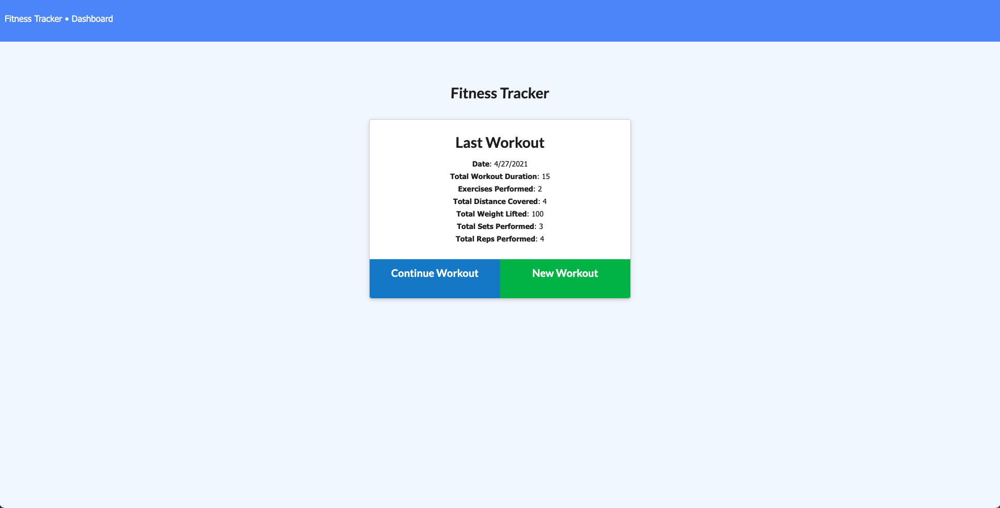
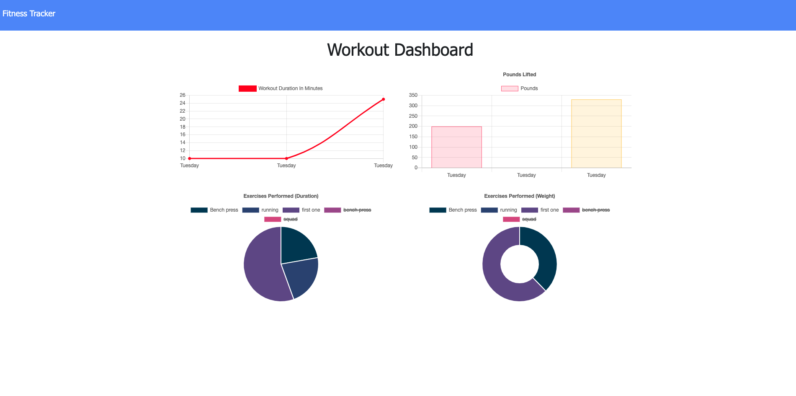

# Fitness_Tracker

* [About-project](#Description)
* [Usage](#Usage)
* [License](#License)
* [Contributor](#Contributor)
* [Email-adress](#Email)
* [LinkedIn-profile](#LinkedIn-profile)
* [GitHub-profile](#GitHub-profile)

   
### About the project:
  This application is a workout tracker that helps user tracking cardio and resistance workouts. Stats are posted to a stats page. The App uses Express sever deployed to heroku and a MongoDB database. 

Screenshots: 

### Usage:

### License:
MIT

### Contributor:
Sandu Corobcenco

### Email adress:
corobcenco.sandu@gmail.com

### LinkedIn profile:
https://www.linkedin.com/in/sandu-corobcenco-527131165/

### GitHub profile:
https://github.com/SanduCorobcenci
